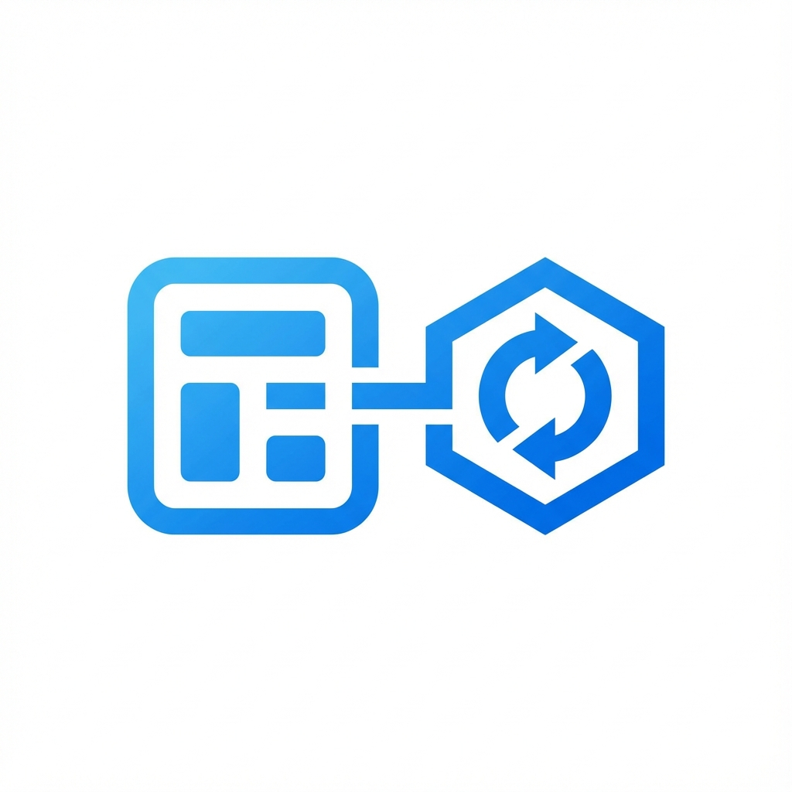

<p align="center">
  
</p>

# state_lifecycle_observer

[](https://pub.dev/packages/state_lifecycle_observer)
[](https://codecov.io/gh/lwj1994/state_lifecycle_observer)

[English](README.md)

使用 Observer 模式解决状态复用问题的 Flutter 包，灵感来自 Android 的 [LifecycleObserver](https://developer.android.com/reference/androidx/lifecycle/LifecycleObserver) 和 [LifecycleOwner](https://developer.android.com/reference/androidx/lifecycle/LifecycleOwner)。

## 特性

- **LifecycleObserver**: 用于创建可复用状态观察者的基类。
- **LifecycleOwnerMixin**: 用于在 `State` 中管理观察者生命周期的 mixin。
- **内置观察者**: 分为 **Base**、**Widget** 和 **Anim** 三类，覆盖常见场景。


## 用法

1. 创建一个 `StatefulWidget` 并混入 `LifecycleOwnerMixin`。
2. 在 `initState` 中实例化观察者。它们会自动注册。
3. 在 `build` 方法中调用 `super.build(context)`。

```dart
class MyLogo extends StatefulWidget {
  final Duration speed;
  const MyLogo({super.key, required this.speed});

  @override
  State<MyLogo> createState() => _MyLogoState();
}

class _MyLogoState extends State<MyLogo> 
    with TickerProviderStateMixin, LifecycleOwnerMixin<MyLogo> {
  
  // 逻辑复用：将 'this' 作为第一个参数传递。
  // 观察者会自动注册到 mixin 中。
  late final _animObserver = AnimControllerObserver(
    this,
    duration: () => widget.speed,
  );

  late final _scrollObserver = ScrollControllerObserver(
    this,
    initialScrollOffset: 100.0,
  );

  @override
  void initState() {
    super.initState();
    _animObserver.target.repeat(reverse: true);
  }

  @override
  Widget build(BuildContext context) {
    // 通知观察者进行构建
    super.build(context);
    
    return SingleChildScrollView(
      controller: _scrollObserver.target,
      child: ScaleTransition(
        scale: _animObserver.target, 
        child: const FlutterLogo()
      ),
    );
  }
}
```

### 使用回调

对于不需要完整观察者的简单场景，可以使用 `addLifecycleCallback`：

```dart
class _MyWidgetState extends State<MyWidget> with LifecycleOwnerMixin {
  @override
  void initState() {
    super.initState();
    addLifecycleCallback(
      onInitState: () {
        debugPrint('Widget 已初始化');
      },
      onDidUpdateWidget: () {
        debugPrint('Widget 已更新');
      },
      onBuild: (context) {
        debugPrint('Widget 正在构建');
      },
      onDispose: () {
        debugPrint('Widget 已销毁');
      },
    );
  }

  @override
  Widget build(BuildContext context) {
    super.build(context);
    return Container();
  }
}
```

### 内置观察者

本库提供三类内置观察者：`Base`、`Widget` 和 `Anim`。

#### 1. Base 观察者 (`observer/base.dart`)

用于数据和异步操作的通用观察者。

- **`ListenableObserver`**: 监听任意 `Listenable`（如 `ValueNotifier`、`ChangeNotifier`），当通知时重建 Widget。
- **`FutureObserver<T>`**: 管理 `Future`，将当前状态暴露为 `AsyncSnapshot`。
- **`StreamObserver<T>`**: 管理 `Stream` 订阅，创建 `AsyncSnapshot` 并处理 active/done 状态。

#### 2. Widget 观察者 (`observer/widget.dart`)

简化常见 Flutter 控制器的创建、销毁和管理。

- **`ScrollControllerObserver`**: 管理 `ScrollController`。
- **`PageControllerObserver`**: 管理 `PageController`。
- **`TabControllerObserver`**: 管理 `TabController`。需要 `TickerProvider`。
- **`TextEditingControllerObserver`**: 管理 `TextEditingController`。
- **`FocusNodeObserver`**: 管理 `FocusNode`。

#### 3. Anim 观察者 (`observer/anim.dart`)

用于动画相关类的观察者。

- **`AnimControllerObserver`**: 管理 `AnimationController`。自动从 Widget 配置同步 `duration` 和 `reverseDuration`。
- **`AnimationObserver<T>`**: 监听 `Animation<T>` 对象，当值变化时重建 Widget。


### 自定义观察者

你可以通过继承 `LifecycleObserver<V>` 轻松创建自己的观察者。

示例：一个获取数据的 `UserDataObserver`。

```dart
import 'package:flutter/material.dart';
import 'package:state_lifecycle_observer/state_lifecycle_observer.dart';

class Data {
  final String id;
  final String info;
  Data(this.id, this.info);
}

// LifecycleObserver<V>，其中 V 是 ValueNotifier<Data?>
class UserDataObserver extends LifecycleObserver<ValueNotifier<Data?>> {
  // 从 Widget 获取最新参数的机制
  final String Function() getUserId;
  
  // 用于追踪变化的内部状态
  late String _currentUserId;

  UserDataObserver(
    super.state, {
    required this.getUserId,
  });

  // 1. 创建 target（在构造函数和 key 变化时调用）
  @override
  ValueNotifier<Data?> buildTarget() {
    _currentUserId = getUserId();
    final notifier = ValueNotifier<Data?>(null);
    _fetchData(_currentUserId, notifier); // 开始获取
    return notifier;
  }

  // 2. 处理 Widget 更新（如果 key 没有变化）
  @override
  void onDidUpdateWidget() {
    super.onDidUpdateWidget();
    // 检查依赖 (userId) 是否发生变化，而不触发完整重建（如果没有使用 key）
    final newUserId = getUserId();
    if (newUserId != _currentUserId) {
      debugPrint('UserId 从 $_currentUserId 变为 $newUserId');
      _currentUserId = newUserId;
      _fetchData(_currentUserId, target);
    }
  }

  @override
  void onBuild(BuildContext context) {
    debugPrint('正在构建用户: $_currentUserId');
  }

  // 3. 清理
  @override
  void onDisposeTarget(ValueNotifier<Data?> target) {
    target.dispose();
  }

  void _fetchData(String id, ValueNotifier<Data?> notifier) async {
    // 模拟网络请求
    await Future.delayed(const Duration(milliseconds: 500));
    // 简单检查以避免竞态条件（如果观察者已被销毁/重建）
    if (_currentUserId == id) { 
      notifier.value = Data(id, 'Info for $id');
    }
  }
}
```

### 使用 `key` 重建 Target

`key` 参数的功能类似于 React 的 `useEffect` 依赖或 Flutter 的 `Key`。
当 `key` 回调返回的值发生变化时，观察者将：
1. 销毁当前 `target`（调用 `onDisposeTarget`）。
2. 重新创建 `target`（调用 `buildTarget`）。

当你的 Controller 依赖于特定属性（如 `userId`）并且需要在该属性变化时完全重置时，这非常有用。

```dart
_observer = MyObserver(
  this,
  // 当 'userId' 变化时，旧的 target 被销毁，新的被构建。
  key: () => widget.userId, 
);
```

> **注意**: 使用 `key` 不是重建 target 的唯一方式。你也可以创建一个新的 Observer 实例。


### 可组合的观察者（嵌套观察者）

与 React Hooks 类似，`LifecycleObserver` 支持**可组合性** — 一个 Observer 可以在内部创建和管理其他 Observer。这使得强大的复用模式成为可能，复杂的行为可以由更简单的、可组合的构建块构建而成。

#### 工作原理

当一个 Observer 在其生命周期方法（如 `onInitState`）中创建子 Observer 时，子 Observer 会通过 Dart 的 [Zone](https://api.dart.dev/stable/dart-async/Zone-class.html) 机制自动注册到顶层 `State`。这意味着你不需要在每一层嵌套中传递 State 引用。

#### 示例：组合观察者

```dart
/// 由多个低层级观察者组成的高层级观察者。
class UserProfileObserver extends LifecycleObserver<void> {
  late final TextEditingControllerObserver _nameController;
  late final FutureObserver<UserData> _dataFetcher;

  UserProfileObserver(super.state, {required String Function() userId});

  @override
  void onInitState() {
    super.onInitState();
    // 子观察者会自动注册到顶层 State。
    // 无需传递 `state` — 它们使用 Zone 查找。
    _nameController = TextEditingControllerObserver(state);
    _dataFetcher = FutureObserver(
      state,
      future: () => fetchUserData(userId()),
    );
  }

  @override
  void buildTarget() {}
}

// 用法：只需创建高层级观察者
class _MyPageState extends State<MyPage> with LifecycleOwnerMixin {
  late final _profileObserver = UserProfileObserver(this, userId: () => widget.userId);
  
  @override
  Widget build(BuildContext context) {
    super.build(context);
    // 所有嵌套的观察者都会被自动管理
    return ...;
  }
}
```

#### 与 Hooks / flutter_hooks 的比较

| 特性 | state_lifecycle_observer | flutter_hooks / React Hooks |
| :--- | :--- | :--- |
| **范式** | OOP (类) | 函数式 (Hooks) |
| **基类** | 标准 `StatefulWidget` | `HookWidget` |
| **生命周期** | 显式 (`buildTarget`, `onDispose`) | 隐式 (`useEffect`) |
| **学习曲线** | 低 (标准 Flutter) | 中 (Hooks 规则) |
| **黑魔法** | 低 (Mixin + List) | 高 (Element 逻辑) |
| **条件逻辑** | 随处支持 | 仅允许在 `build` 中使用 |
| **组合方式** | 在自定义 Observer 中创建 Observer | 在自定义 hook 中调用 hook |
| **注册机制** | 通过 Zone 自动注册 | 通过 fiber context 自动注册 |
| **嵌套深度** | 无限制 | 无限制 |
| **生命周期同步** | 所有嵌套 Observer 跟随父级生命周期 | 所有 hook 跟随组件生命周期 |

这种可组合性使 `LifecycleObserver` 在构建可复用、模块化的状态逻辑方面与 hooks 一样灵活。
